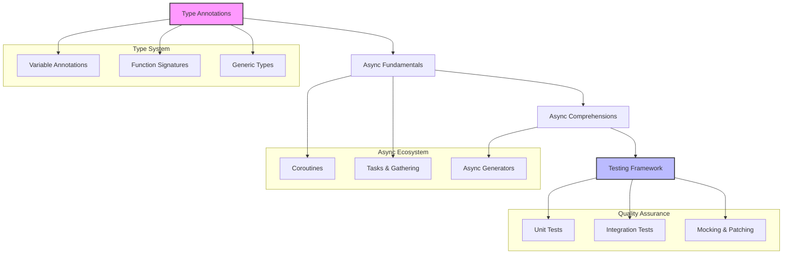
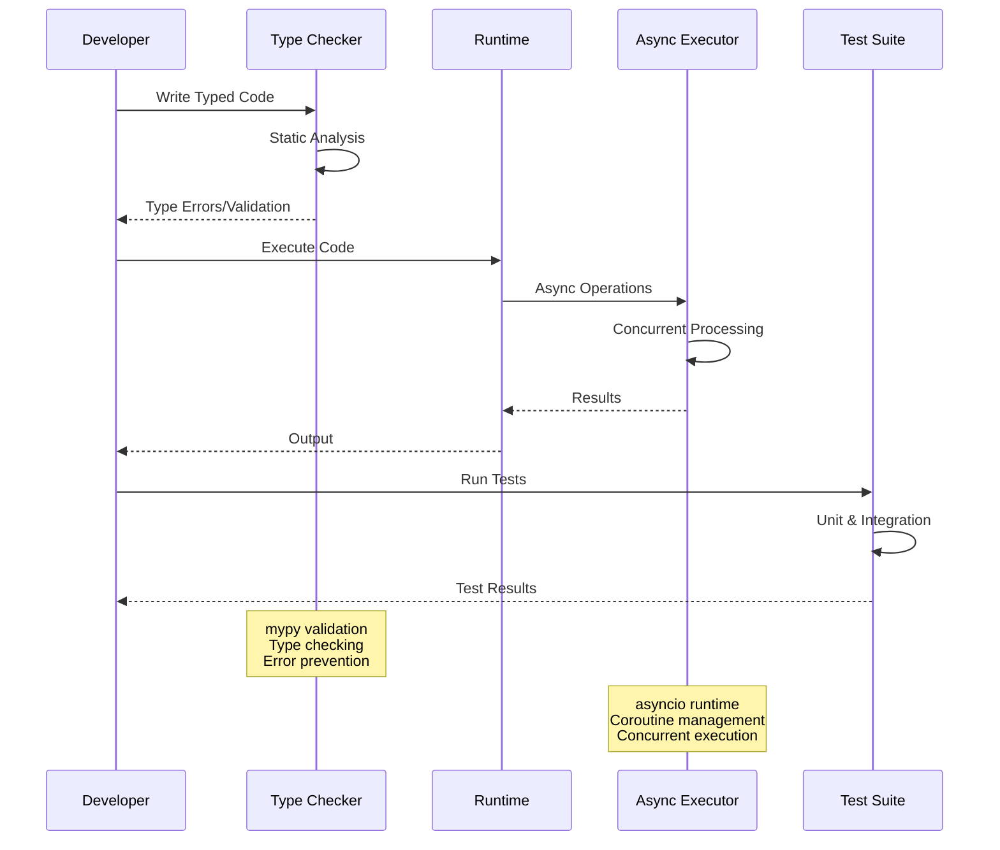
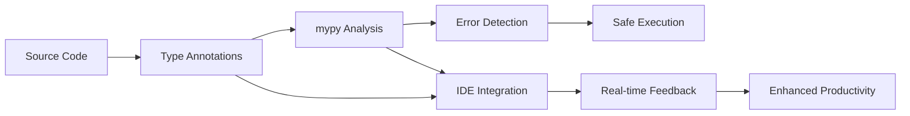

# 🏗️ System Architecture

## 📖 Overview
The ALX Backend Python curriculum implements a progressive architecture focused on modern Python development practices, emphasizing type safety, asynchronous programming, and comprehensive testing. The system architecture builds from fundamental type annotations to advanced async patterns and production-ready testing methodologies.

---

## 🏛️ High-Level Architecture

The architecture emphasizes incremental complexity introduction while maintaining practical applicability and industry-standard practices throughout the learning progression.

---

## 🧩 Core Components

### Type Annotation System
- **Purpose**: Establish static type checking and enhanced code documentation
- **Technology**: Python 3.7+ type hints, mypy static analyzer
- **Location**: `./0x00-python_variable_annotations/`
- **Responsibilities**:
  - Variable and function type declarations
  - Generic type handling and constraints
  - Type validation and error prevention
  - IDE integration and developer experience enhancement

### Asynchronous Programming Foundation
- **Purpose**: Master non-blocking I/O and concurrent execution patterns
- **Technology**: asyncio, coroutines, async/await syntax
- **Location**: `./0x01-python_async_function/`
- **Responsibilities**:
  - Coroutine creation and lifecycle management
  - Concurrent execution with asyncio.gather
  - Performance measurement and optimization
  - Task scheduling and coordination

### Advanced Async Patterns
- **Purpose**: Implement sophisticated asynchronous programming techniques
- **Technology**: async generators, comprehensions, advanced asyncio patterns
- **Location**: `./0x02-python_async_comprehension/`
- **Responsibilities**:
  - Async generator implementation and usage
  - Asynchronous list and generator comprehensions
  - Performance optimization in async contexts
  - Memory-efficient async data processing

### Testing & Quality Assurance Framework
- **Purpose**: Comprehensive testing strategies for Python applications
- **Technology**: unittest, mock, integration testing patterns
- **Location**: `./0x03-Unittests_and_integration_tests/`
- **Responsibilities**:
  - Unit test design and implementation
  - Mock object creation and management
  - Integration testing strategies
  - Test automation and continuous integration

---

## 📊 Data Flow Architecture

---

## 🔧 Design Patterns & Principles

### Type-Driven Development
- **Static Verification**: Catching errors before runtime
- **Self-Documenting Code**: Types serve as documentation
- **IDE Enhancement**: Better autocomplete and error detection
- **Refactoring Safety**: Type system enables safe code changes

### Asynchronous Design Patterns
- **Non-Blocking I/O**: Improved application responsiveness
- **Concurrent Processing**: Parallel task execution
- **Resource Efficiency**: Better memory and CPU utilization
- **Scalability**: Handling higher loads with async patterns

### Testing Architecture
- **Test Pyramid**: Unit tests at base, integration tests at top
- **Mock Isolation**: Testing units in isolation
- **Behavioral Testing**: Testing expected behaviors and outcomes
- **Continuous Validation**: Automated testing in development workflow

---

## 🚀 Development Architecture

### Type-Safe Development Environment

### Async Runtime Environment
- **Event Loop Management**: Single-threaded async execution
- **Coroutine Scheduling**: Efficient task coordination
- **I/O Multiplexing**: Handling multiple operations concurrently
- **Resource Management**: Memory and connection pooling

### Testing Pipeline
- **Automated Testing**: Continuous test execution
- **Coverage Analysis**: Comprehensive code coverage tracking
- **Mock Integration**: Isolated component testing
- **Performance Testing**: Async performance validation

---

## 🔒 Quality Assurance Architecture

### Static Analysis
- **Type Checking**: mypy integration for type validation
- **Code Quality**: Linting and style enforcement
- **Error Prevention**: Catching issues before runtime
- **Documentation**: Type-based documentation generation

### Dynamic Testing
- **Unit Testing**: Individual component validation
- **Integration Testing**: Component interaction testing
- **Performance Testing**: Async performance benchmarking
- **Regression Testing**: Preventing code regressions

---

## 📈 Performance Architecture

### Async Performance Optimization
- **Non-Blocking Operations**: Maximizing CPU utilization
- **Concurrent Execution**: Parallel processing capabilities
- **Memory Efficiency**: Generator-based lazy evaluation
- **I/O Optimization**: Efficient handling of blocking operations

### Type System Performance
- **Runtime Efficiency**: No runtime type checking overhead
- **Development Speed**: Faster debugging and development
- **Maintenance Benefits**: Easier refactoring and updates
- **Team Productivity**: Better collaboration through type contracts

---

## 🧪 Testing Architecture

### Test Strategy
- **Unit Testing**: Isolated component testing
- **Integration Testing**: System interaction validation
- **Mock Testing**: Dependency isolation and simulation
- **Performance Testing**: Async execution benchmarking

### Test Automation
- **Continuous Integration**: Automated test execution
- **Coverage Reporting**: Test coverage analysis
- **Regression Detection**: Preventing code breakage
- **Quality Gates**: Automated quality enforcement

---

## 🔄 Maintenance & Evolution

### Code Maintenance
- **Type Safety**: Safer refactoring with type checking
- **Documentation**: Self-documenting type annotations
- **Error Prevention**: Early error detection and prevention
- **Code Quality**: Consistent coding standards

### Technology Evolution
- **Python Updates**: Leveraging new Python features
- **Type System Enhancement**: Advanced typing capabilities
- **Async Ecosystem**: New async libraries and patterns
- **Testing Tools**: Enhanced testing frameworks and tools

---

## 🌐 Integration Patterns

### Web Framework Integration
- **FastAPI**: Type-native web framework integration
- **Flask**: Type annotations for Flask applications
- **Django**: Type safety in Django projects
- **API Documentation**: Automatic API docs from types

### Database Integration
- **ORM Typing**: Type-safe database operations
- **Async Databases**: Non-blocking database access
- **Migration Safety**: Type-checked schema changes
- **Query Optimization**: Type-guided query performance

---

*This architecture supports the development of modern, type-safe, high-performance Python backend applications with comprehensive testing and quality assurance practices.*
